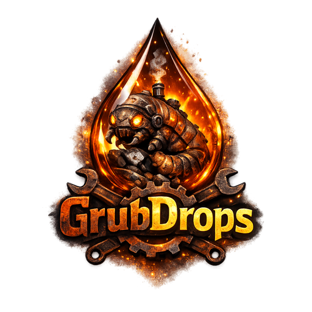
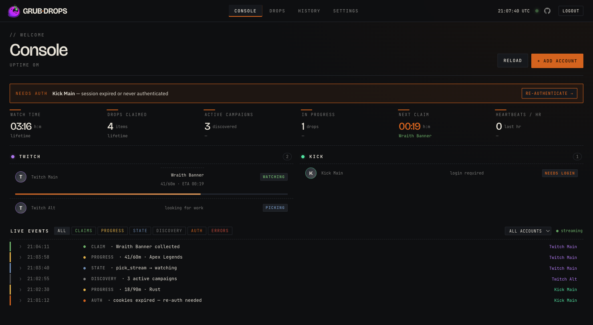
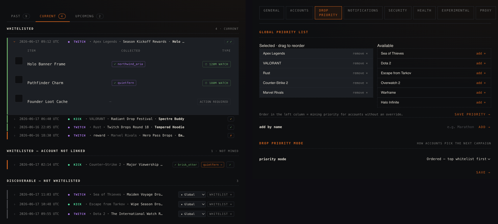

<p align="center">
  
</p>

<p align="center"><sub><strong>Inglés</strong> · <a href="docs/translations/README.zh-CN.md">简体中文</a> · <a href="docs/translations/README.es.md">Español</a></sub></p>

<h3 align="center">Miner de drops de Twitch y Kick autoalojado y "configura y olvida".</h3>

<p align="center">
  
  
  
  
  
  
  
  <a href="https://github.com/aalejandrofer/GrubDrops/releases"></a>
  <a href="https://github.com/aalejandrofer/GrubDrops/pkgs/container/grubdrops"></a>
  
</p>

<p align="center">
  
</p>

<p align="center">
  
</p>

---

Mira las transmisiones adecuadas de Twitch y Kick, acumula el tiempo de visualización y reclama los drops, todo para varias cuentas a la vez. Una pequeña aplicación web autoalojada: una imagen de Docker y un solo archivo SQLite.

## Características

- 🟣🟢 **Twitch y Kick, lado a lado** — muchas cuentas, un solo panel.
- 🎯 **Configura y olvida** — elige tus juegos; él se encarga de descubrir, ver, acumular el tiempo y reclamar por ti.
- 🔒 **Autoalojado y privado** — un solo contenedor, tus cuentas, tus datos.
- ⚡ **Fiable en ambas plataformas** — gestiona las partes complicadas (inicios de sesión, enlaces, reproducción en Kick) para que tú no tengas que hacerlo.
- 🛠️ **Diseñado para funcionar sin supervisión** — alertas de Discord, comprobación de actualizaciones, multilingüe, proxy y SSO.

## Primeros pasos

### Prerrequisitos

**Docker + Docker Compose** (ruta rápida) o **Go 1.26+** (compilar desde el código fuente).
Lo que necesitas depende de la plataforma que estés minerando:

| | Twitch | Kick |
|---|---|---|
| **Inicio de sesión** | device-code (`twitch.tv/activate`) | exportación `cookies.txt` |
| **Cómo visualiza** | HTTP directo — sin navegador | WebSocket; respaldo de Chrome **sidecar** (reproducción IVS) |
| **Docker** | opcional | **altamente recomendado** — WS funciona sin él, pero el respaldo de Chrome IVS necesita el socket de Docker |
| **Ejecutar desde código, sin Docker** | ✅ un binario simple de `go build` funciona | ⚠️ WS funciona; el respaldo de Chrome necesita Docker |
| **Arq. de CPU** | cualquiera — `amd64` + `arm64` | `amd64` + `arm64` (arm64 es pesado — ver nota) |

Twitch usa HTTP directo: un binario Go simple lo mina en cualquier lugar, sin Docker. Kick mina sin navegador a través de WebSocket de forma predeterminada; el respaldo confiable de Chrome IVS se ejecuta como sidecar a través del socket de Docker, por lo que **Docker es altamente recomendado para Kick**.

> **Raspberry Pi / ARM:** ambas imágenes incluyen `arm64`; el sidecar usa Chromium de Debian (conserva los códecs H.264/AAC para el flujo IVS de Kick). Pesado: ~4 GB de RAM cada uno.
>
> **Ruta de visualización de Kick:** predeterminado en *WS, con respaldo a Chrome* — intenta primero la ruta WebSocket sin navegador (sin Docker) y cambia al sidecar de Chrome solo si WS deja de acumular. Mantén el montaje del socket de Docker para que funcione el respaldo; fuerza *Chrome sidecar* o *Solo WebSocket* en Configuración → Experimental.

### Plataformas compatibles

| Anfitrión | Twitch | Kick |
|---|---|---|
| Linux `x86-64` | ✅ | ✅ |
| Linux `arm64` / Raspberry Pi | ✅ | ✅ — sidecar Chromium, ~4 GB de RAM cada uno |
| macOS / Windows · Docker Desktop (Intel) | ✅ | ✅ |
| macOS / Windows · Apple Silicon | ✅ | ✅ — sidecar Chromium arm64 |
| `go build` desde el código fuente (cualquier SO) | ✅ | ✅ WS; el respaldo de Chrome necesita Docker |

### Ejecutarlo

Usa el compose con la imagen publicada: solo el **miner**. Crea automáticamente un **sidecar** de Chrome por cuenta de Kick bajo demanda a través del socket de Docker montado; no defines servicios sidecar.

```yaml
# compose.yml
services:
  miner:
    image: ghcr.io/aalejandrofer/grubdrops:latest
    restart: unless-stopped
    ports: ["8080:8080"]
    environment:
      GRUB_MASTER_KEY: "${GRUB_MASTER_KEY:?generate one with docker run --rm ghcr.io/aalejandrofer/grubdrops:latest keygen}"
      GRUB_DB_PATH: /data/miner.db
      GRUB_SECURE_COOKIES: "0"   # plain-HTTP localhost; set 1 behind HTTPS
      TZ: Europe/London           # server-side timezone
    volumes:
      - ./data:/data
      - /var/run/docker.sock:/var/run/docker.sock # Kick only, if WS Breaks

  # Actualización automática opcional: descarga una nueva imagen y recrea solo el miner.
  # watchtower:
  #   image: containrrr/watchtower:latest
  #   restart: unless-stopped
  #   volumes:
  #     - /var/run/docker.sock:/var/run/docker.sock
  #   command: --interval 21600 --cleanup grubdrops
```

La `GRUB_MASTER_KEY` debe ser una **identidad X25519 de age** (`AGE-SECRET-KEY-1…`): cifra los tokens de sesión almacenados. Una cadena aleatoria no se analizará y el miner fallará al iniciarse. Genera una válida solo con Docker:

```bash
docker run --rm ghcr.io/aalejandrofer/grubdrops:latest keygen
# → AGE-SECRET-KEY-1... (consérvala; reutiliza la MISMA clave en cada reinicio)
```

La imagen se ejecuta como `nonroot` sin sistema operativo (**UID 65532**), por lo que debes hacer que `./data` montado en bind sea escribible primero; de lo contrario, no podrá escribir `miner.db` y el inicio de sesión fallará con *"failed to persist session"*. (O usa un volumen nombrado.)

```bash
mkdir -p data && sudo chown 65532:65532 data
GRUB_MASTER_KEY="$(docker run --rm ghcr.io/aalejandrofer/grubdrops:latest keygen)" docker compose up -d
```

Abre **http://localhost:8080** y crea la sesión de administrador.

- **¿Despliegue en Portainer / GUI?** No hay shell para establecer la variable, así que añade `GRUB_MASTER_KEY` (valor de `keygen` anterior) en la sección de **Variables de entorno** del stack antes de desplegar. Usa `docker compose` simple, no un stack de Swarm, en un Docker Engine actual.
- **¿Solo Twitch?** Omite el montaje del socket de Docker: no se crearán sidecars.
- **¿Toda la configuración?** Compose de referencia: [`deploy/docker-compose.yml`](deploy/docker-compose.yml).
- **¿Compilarlo?** `docker build -f deploy/Dockerfile.miner .`, o `go build ./cmd/miner`.

## Añadir cuentas

Ve a **Cuentas** y añade una por plataforma.

**Twitch.** Haz clic en añadir y aprueba el código mostrado en `twitch.tv/activate`.
Es el flujo oficial device-code; tu contraseña y cookies nunca entran en contacto con GrubDrops.

**Kick.** Kick no tiene una API de inicio de sesión pública, por lo que debes proporcionar a GrubDrops tu sesión existente de kick.com como un archivo `cookies.txt` exportado desde tu navegador:

1. Instala una extensión de exportación de cookies:
   [Get cookies.txt LOCALLY](https://chromewebstore.google.com/detail/get-cookiestxt-locally/cclelndahbckbenkjhflpdbgdldlbecc)
   para Chrome/Edge/Brave, o
   [cookies.txt](https://addons.mozilla.org/en-US/firefox/addon/cookies-txt/) para Firefox.
2. Inicia sesión en `kick.com`, haz clic en el icono de la extensión y **Exporta** el sitio actual.
3. En GrubDrops, abre la página **Autorizar** de la cuenta y sube (o pega) la exportación.

Los canales se descubren automáticamente según el juego de cada campaña, por lo que no hay nada más que configurar. Cuando la sesión caduque (el descubrimiento registre errores de Cloudflare o 401), vuelve a exportar y pegar.

## Seleccionar qué minerar

GrubDrops funciona con listas blancas: solo descubre y mina juegos que selecciones, por lo que **una instalación nueva no mina nada hasta que añadas al menos un juego a la lista blanca**. Hasta entonces, `/drops` mostrará un aviso que te dirige aquí, y las cuentas se mantendrán en estado de *"sin juegos todavía"* (no es un error).

Añade juegos de cualquier forma — por nombre, sin necesidad de esperar a que aparezca una campaña primero:

- **Global** (se aplica a todas las cuentas): **Prioridad → añadir por nombre**.
- **Por cuenta** (anula la lista global): **Cuentas → elige una cuenta → añadir por nombre**.

El descubrimiento comenzará a rastrear ese juego en el siguiente ciclo y las campañas en vivo aparecerán en `/drops`.

## Cómo funciona

- **Twitch:** inicio de sesión device-code, luego GraphQL + PubSub para rastrear el progreso y reclamar.
- **Kick:** la detección/reclamaciones usan un cliente HTTP con huella TLS de Chrome (`utls`) — sin baile de Cloudflare, sin navegador. El tiempo de visualización necesita un reproductor real, por lo que se ejecuta en un sidecar de Chrome por cuenta bajo demanda (reproducción IVS) que el miner crea/detiene a través del socket de Docker; una limpieza elimina los contenedores de cuentas eliminadas.
- **Descubrimiento** extrae ambos catálogos a SQLite cada pocos minutos.

## Lógica de prioridad

Cada cuenta mina una campaña a la vez. Cuando varias campañas en la lista blanca son elegibles, GrubDrops las selecciona en este orden:

```
1. Campaña, según tu modo de prioridad (Configuración):
   ├─ ordered (predeterminado)  → tu ranking de lista blanca, primero el superior
   ├─ ending_soonest     → primer plazo de finalización
   └─ low_avbl_first     → menor cantidad de canales disponibles primero
2. Desempate: más cercano a una reclamación (menos minutos de visualización restantes)
3. Campañas restringidas (de equipo) por delante de las abiertas (ambas plataformas)
4. Canal: una transmisión en vivo confirmada en el juego de la campaña,
   mayor cantidad de espectadores primero (Twitch también verifica si realmente
   sirve el drop objetivo)
```

La lista blanca y la prioridad son por cuenta, con respaldo a la lista global. Una campaña sin transmisión en vivo se omite, no se espera.

## Configuración

Variables de entorno; solo `GRUB_MASTER_KEY` es **obligatoria**, el resto toman el valor predeterminado mostrado.

| Var | Predeterminado | Propósito |
|-----|---------|---------|
| `GRUB_MASTER_KEY` | **obligatorio** | Clave para el almacén de sesiones cifrado con age. |
| `GRUB_HTTP_ADDR` | `:8080` | Dirección de escucha. |
| `GRUB_DB_PATH` | `/data/miner.db` | Ruta de SQLite (usa p. ej. `./miner.db` fuera de Docker). |
| `GRUB_KICK_SIDECAR_IMAGE` | `ghcr.io/aalejandrofer/grubdrops-browser:latest` | Imagen sidecar que el miner descarga por cuenta. |
| `GRUB_KICK_SIDECAR_NETWORK` | autodetectada | Anular la red sidecar autodetectada. |
| `GRUB_KICK_SIDECAR_TEMPLATE` | `grubdrops-browser-{slug}` | Plantilla de nombre del contenedor sidecar. |
| `GRUB_KICK_SIDECAR_PORT` | `9090` | Puerto gRPC del sidecar. |
| `GRUB_BROWSER_URL` | ninguno | Dirección sidecar fija (siempre encendido heredado). |
| `GRUB_BROWSER_URLS` | ninguno | Pool sidecar siempre encendido, separado por comas. |
| `GRUB_DISCOVERY_INTERVAL` | `60m` | Frecuencia de extracción del catálogo; también en Configuración. |
| `GRUB_AUTHCHECK_INTERVAL` | `1h` | Frecuencia de barrido de salud de autenticación. |
| `GRUB_DISCORD_WEBHOOK` | ninguno | Webhook global de Discord. |
| `GRUB_SECURE_COOKIES` | `0` | `1` marca las cookies como `Secure` (solo HTTPS); mantén `0` para HTTP simple — ver nota. |
| `GRUB_LOG_LEVEL` | `info` | `debug`, `info`, `warn`, `error`. |
| `GRUB_AUTHBYPASS` | `false` | **Deshabilita toda autenticación** cuando es verdadero (`1`/`true`). |
| `GRUB_TWITCH_BROWSER` | `0` | `1` enruta Twitch a través del sidecar del navegador en lugar de HTTP directo. Experimental; se recomienda la ruta predeterminada de HTTP directo. |
| `GRUB_CANARY_INTERVAL` | valor de la pestaña Salud | Anula la frecuencia de ejecución del canary de acumulación (p. ej. `6h`); cae en el valor de Configuración ▸ Salud. |

> **¿"Invalid CSRF token"?** `GRUB_SECURE_COOKIES` debe coincidir con tu esquema: `0` sobre HTTP simple, `1` sobre HTTPS (el proxy debe reenviar `X-Forwarded-Proto: https`). Una incompatibilidad marca las cookies como `Secure` sobre HTTP, por lo que se descartan y las solicitudes POST fallan. Una verificación fallida registra `csrf check failed` con la causa probable.

### Inicio de sesión único (OIDC)

Opcional (el inicio de sesión con contraseña se mantiene como respaldo). Cualquier proveedor OIDC; se activa una vez que se establecen los primeros cuatro:

| Var | Requerido | Propósito |
|-----|----------|---------|
| `GRUB_OIDC_ISSUER` | sí | URL del emisor. |
| `GRUB_OIDC_CLIENT_ID` | sí | ID de cliente OAuth. |
| `GRUB_OIDC_CLIENT_SECRET` | sí | Secreto de cliente OAuth. |
| `GRUB_OIDC_REDIRECT_URL` | sí | `https://<host>/auth/oidc/callback`, registrado con el IdP. |
| `GRUB_OIDC_PROVIDER_NAME` | no | Etiqueta del botón (predeterminado `SSO`). |
| `GRUB_OIDC_ALLOWED_EMAILS` | no | Lista blanca de correos electrónicos separada por comas. |
| `GRUB_OIDC_ALLOWED_GROUPS` | no | Grupo(s) requerido(s) en el claim `groups`. |

> **Precaución:** sin una lista blanca configurada, cualquiera que el IdP autentifique se convertirá en administrador. Delimita la membresía en el IdP o configura una lista blanca.

## Las páginas

| Página | Contenido |
|------|------|
| **Consola** (`/`) | Estadísticas de por vida, minería por cuenta, feed de eventos en vivo. |
| **Drops** (`/drops`) | Campañas pasadas / actuales / próximas, elementos, chips de conexión, listado en un clic. |
| **Prioridad** (`/priority`) | Lista blanca global y por cuenta de juegos + orden de minería. |
| **Historial** (`/history`) | Registro de reclamaciones en todas las cuentas. |
| **Configuración** (`/settings`) | Intervalos, Discord, proxy, idioma, salud, nivel de registro, contraseña. |
| **Cuentas** | Añadir cuentas, listas blancas por cuenta, reautenticación, salud de autenticación. |

## Arquitectura

```
cmd/miner               main daemon
internal/platform/...   per-platform backends (twitch, kick)
internal/watcher        per-account state machine (watch, mine, claim)
internal/dockerctl      on-demand sidecar start/stop over the docker socket
internal/discovery      catalog scraper
internal/api + web      HTMX UI and handlers
internal/store          SQLite (sqlc + goose), age-encrypted sessions
```

## Créditos

Se basa en los proyectos que resolvieron las partes más difíciles primero:

- **[DevilXD/TwitchDropsMiner](https://github.com/DevilXD/TwitchDropsMiner)** — flujo device-code de Twitch, GraphQL, mecánicas de tiempo de visualización.
- **[HyperBeats/KickDropsMiner](https://github.com/HyperBeats/KickDropsMiner)** — mapeó cómo funcionan los drops de Kick.

GrubDrops es su propia reescritura en Go (UI web, multicuenta), pero no existiría sin sus cimientos.

## Licencia

Publicado bajo la [Licencia MIT](LICENSE).

## Una nota sobre el uso responsable

Autoalojado, inquilino único. `/healthz` para estado de actividad; conserva `/data` entre red despliegues; úsalo con proxy inverso si está expuesto. Cumple con los TOS de cada plataforma, en tus propias cuentas y bajo tu propio riesgo.

---

<sub>Desarrollado por <a href="https://github.com/aalejandrofer">@aalejandrofer</a> con <a href="https://claude.com/claude-code">Claude Code</a>. Consulta el <a href="docs/CHANGELOG.md">registro de cambios</a> y las <a href="docs/DESIGN.md">notas de diseño</a>.</sub>
