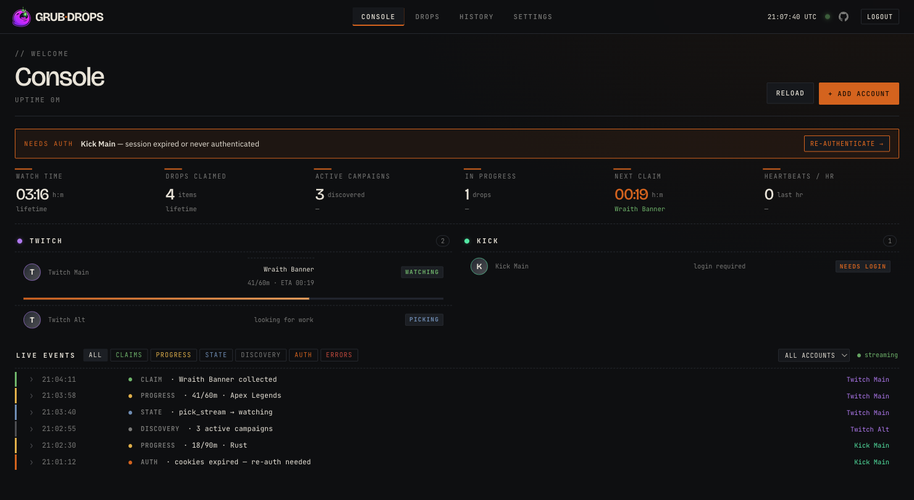

<p align="center">
  
</p>

<h3 align="center">Minero de drops de Twitch y Kick autoalojado y de configurar y olvidar.</h3>

<p align="center">
  
  
  
  
  
  
  <a href="https://github.com/aalejandrofer/grubdrops/releases"></a>
  <a href="https://github.com/aalejandrofer/grubdrops/pkgs/container/grubdrops"></a>
  
</p>

<p align="center">
  
</p>

[English](README.md) · [简体中文](README.zh-CN.md) · **Español**

---

GrubDrops mira por ti los streams adecuados de Twitch y Kick, acumula el
tiempo de visualización y reclama los drops dentro del juego, en varias cuentas
a la vez. Una pequeña aplicación web en tu propia máquina: se distribuye como
imagen de Docker y lo guarda todo en un único archivo SQLite.

## Características

- 🎯 **Tú defines una lista blanca** (global o por cuenta). Nada fuera de ella se mina.
- 🟣🟢 **Twitch y Kick juntos**, varias cuentas en cada uno, todo en una misma página.
- ✅ **Comprueba el juego** para que nunca gastes tiempo de visualización en el stream equivocado.
- 🔗 **Conoce los enlaces de cuenta** (Krafton, Embark, …) con una anulación manual por cuenta del tipo "ya lo he enlazado".
- 🖥️ **Una consola en vivo**: estadísticas totales, minado actual, catálogo de drops, historial de reclamos.
- 🔔 **Notificaciones de Discord**, activables por tipo de evento.
- 🔒 **Tus credenciales siguen siendo tuyas**: Twitch usa el inicio de sesión oficial por código de dispositivo, Kick usa una sesión que tú exportas. No se envía ninguna contraseña a GrubDrops.

## Primeros pasos

### Requisitos previos

**Docker + Docker Compose** (vía rápida) o **Go 1.26+** (compilar desde el código fuente).
Lo que necesites depende de qué plataforma estés minando:

| | Twitch | Kick |
|---|---|---|
| **Inicio de sesión** | código de dispositivo (`twitch.tv/activate`) | exportación de `cookies.txt` |
| **Cómo mira** | HTTP directo — sin navegador | **sidecar** de Chrome (reproducción IVS real) |
| **Docker** | opcional | **obligatorio** — el minero genera el sidecar a través del socket de Docker |
| **Ejecutar desde el código fuente, sin Docker** | ✅ basta un binario `go build` normal | ❌ necesita Docker para el sidecar |
| **Arquitectura de CPU** | cualquiera — `amd64` + `arm64` | host `amd64` (ver nota sobre ARM) |

Twitch funciona sobre HTTP directo, así que un binario de Go normal lo mina en cualquier sitio —Raspberry Pi incluida, sin Docker. **El tiempo de visualización de Kick necesita un reproductor real**, así que el minero ejecuta un sidecar de Chrome a través del socket de Docker, lo que hace que **Docker sea obligatorio para Kick**.

> **Raspberry Pi / ARM:** la imagen del minero se publica para `linux/amd64` *y*
> `linux/arm64`, así que los drops de Twitch se ejecutan de forma nativa en una Pi. El sidecar de Kick es
> **solo amd64** hoy en día: Google Chrome para Linux es exclusivamente x86-64, y el sidecar
> lo incluye específicamente por los **códecs propietarios H.264/AAC** que decodifican
> el stream IVS de Kick —el Chromium de código abierto para arm64 se distribuye sin ellos. Así que
> Kick-en-ARM necesita actualmente un host amd64; se está explorando una vía para Kick sin navegador (que
> levantaría esta limitación).

### Plataformas compatibles

| Host | Twitch | Kick |
|---|---|---|
| Linux `x86-64` | ✅ | ✅ |
| Linux `arm64` / Raspberry Pi | ✅ | ❌ — el sidecar es solo amd64 |
| macOS / Windows · Docker Desktop (Intel) | ✅ | ✅ |
| macOS / Windows · Apple Silicon | ✅ | ❌ — sidecar amd64 |
| `go build` desde el código fuente (cualquier SO) | ✅ | necesita Docker + un host amd64 |

### Ejecutarlo

Docker Compose con las imágenes publicadas es la vía más rápida —solo el
**miner**. Para el tiempo de visualización de Kick, crea automáticamente bajo demanda un
**sidecar** de Chrome con códecs habilitados por cada cuenta (a través del socket de Docker montado), de modo que
no defines tú ningún servicio de sidecar. (¿Solo Twitch? Ver más abajo.)

```yaml
# compose.yml
services:
  miner:
    image: ghcr.io/aalejandrofer/grubdrops:latest
    restart: unless-stopped
    ports: ["8080:8080"]
    environment:
      GRUB_MASTER_KEY: ${GRUB_MASTER_KEY:?run: head -c32 /dev/urandom | base64}
      GRUB_DB_PATH: /data/miner.db
      GRUB_SECURE_COOKIES: "0"   # plain-HTTP localhost; set 1 behind HTTPS
    volumes:
      # The container runs as nonroot (UID 65532); make ./data writable by it
      # first (see below) or use a named volume instead of a bind mount.
      - ./data:/data
      # lets the miner create/start/stop per-account browser sidecars on demand
      - /var/run/docker.sock:/var/run/docker.sock
```

**Haz primero que el directorio de datos sea escribible.** La imagen del minero se ejecuta como el usuario
`nonroot` de distroless (**UID 65532**). Un `./data` recién montado por bind es propiedad de tu
usuario del host, así que el contenedor no puede escribir `miner.db` —las sesiones nunca persisten y
el inicio de sesión falla con *"failed to persist session"* justo después de una verificación correcta.
Entrega el directorio al usuario del contenedor antes de levantarlo:

```bash
mkdir -p data && sudo chown 65532:65532 data
```

(O sáltate el bind mount por completo y usa un volumen de Docker con nombre —Docker crea
esos ya escribibles por el contenedor.)

Levántalo. `GRUB_MASTER_KEY` cifra las sesiones almacenadas, así que genera una de verdad:

```bash
GRUB_MASTER_KEY=$(head -c32 /dev/urandom | base64) docker compose up -d
```

Abre **http://localhost:8080**. La primera visita te pide crear un inicio de sesión de administrador.

**¿Solo Twitch?** Quita el montaje del socket de Docker y deja `GRUB_BROWSER_URL`
sin definir —nunca se crea ningún sidecar de Kick (Kick simplemente no tiene ninguna vía de acumulación de tiempo
de visualización sin uno).

**¿Quieres cada ajuste?** El compose de referencia completo (perfiles del sidecar, OIDC, cada
ajuste comentado) está en
[`deploy/docker-compose.yml`](deploy/docker-compose.yml).

**¿Compilarlo tú mismo?** `docker build -f deploy/Dockerfile.miner .`, o un simple
`go build ./cmd/miner` para un binario local.

## Añadir cuentas

Ve a **Accounts** y añade una por plataforma.

**Twitch.** Haz clic en añadir y luego aprueba el código mostrado en `twitch.tv/activate`.
Ese es el flujo oficial de código de dispositivo; tu contraseña y tus cookies nunca tocan
GrubDrops.

**Kick.** Kick no tiene una API pública de inicio de sesión, así que le entregas a GrubDrops tu
sesión existente de kick.com como un archivo `cookies.txt` exportado desde tu navegador:

1. Instala una extensión de exportación de cookies:
   [Get cookies.txt LOCALLY](https://chromewebstore.google.com/detail/get-cookiestxt-locally/cclelndahbckbenkjhflpdbgdldlbecc)
   para Chrome/Edge/Brave, o
   [cookies.txt](https://addons.mozilla.org/en-US/firefox/addon/cookies-txt/) para Firefox.
2. Inicia sesión en `kick.com`, haz clic en el icono de la extensión y haz **Export** del sitio actual.
3. En GrubDrops, abre la página **Authorize** de la cuenta y sube (o pega) la exportación.

Los canales se descubren automáticamente a partir del juego de cada campaña, así que no hay nada más que
configurar. Cuando la sesión caduque (el descubrimiento registra errores de Cloudflare o 401),
vuelve a exportarla y pégala de nuevo.

## Cómo funciona

- **Twitch:** inicio de sesión por código de dispositivo y luego GraphQL y PubSub para seguir el progreso y
  disparar los reclamos en tiempo real.
- **Kick:** la detección y los reclamos van sobre un cliente HTTP con huella TLS de Chrome
  (`utls`), así que no hay baile de Cloudflare ni navegador que vigilar. El
  tiempo de visualización en sí necesita un reproductor real, así que se ejecuta en un sidecar de
  Chrome bajo demanda y por cuenta que reproduce el stream IVS. El minero crea, arranca y
  detiene automáticamente ese contenedor a través del socket de Docker (descargando la imagen del sidecar según
  haga falta), de modo que Chrome solo se ejecuta mientras mira y tú no defines ningún servicio de sidecar.
  Un barrido periódico elimina los contenedores de las cuentas eliminadas.
- **El descubrimiento (Discovery)** barre ambos catálogos hacia SQLite cada pocos minutos para que el
  panel siempre refleje lo que está en directo.

## Lógica de prioridad

Cada cuenta mina una campaña a la vez. Cuando varias campañas en la lista blanca
son elegibles, GrubDrops elige en este orden:

```
1. Campaign, by your priority mode (Settings):
   ├─ ordered (default)  → your whitelist rank, top of the list first
   ├─ ending_soonest     → soonest deadline first
   └─ low_avbl_first     → fewest available channels first
2. Tiebreak: closest to a claim (fewest watch-minutes remaining)
3. Restricted (team) campaigns ahead of open ones (both platforms)
4. Channel: a live stream confirmed on the campaign's game,
   highest viewer count first (Twitch also probes for one
   actually serving the target drop)
```

La lista blanca y la prioridad son por cuenta, recurriendo a la lista global como respaldo. Una
campaña sin ningún stream en directo se omite, no se queda esperando.

## Configuración

Todos los ajustes son variables de entorno. `GRUB_MASTER_KEY` es la única **obligatoria**.
Todas las demás variables de abajo son **opcionales**: déjalas sin definir para tomar el
valor por defecto mostrado.

| Variable | Por defecto | Propósito |
|-----|---------|---------|
| `GRUB_MASTER_KEY` | **obligatoria** | Clave para el almacén de sesiones cifrado con age. |
| `GRUB_HTTP_ADDR` | `:8080` | Dirección de escucha. |
| `GRUB_DB_PATH` | `/data/miner.db` | Ruta de SQLite (usa p. ej. `./miner.db` fuera de Docker). |
| `GRUB_KICK_SIDECAR_IMAGE` | `ghcr.io/aalejandrofer/grubdrops-browser:latest` | Imagen que el minero descarga y ejecuta por cada sidecar autocreado. El visionado de Kick siempre se hace a través de un sidecar (la única vía de acumulación); ninguno configurado = Kick no puede mirar. |
| `GRUB_KICK_SIDECAR_NETWORK` | autodetectada | Red de Docker a la que conectar los sidecars. Por defecto, la propia red del minero (autodetectada); defínela para anularla. |
| `GRUB_KICK_SIDECAR_TEMPLATE` | `grubdrops-browser-{slug}` | Plantilla del nombre de contenedor del sidecar por cuenta. |
| `GRUB_KICK_SIDECAR_PORT` | `9090` | Puerto gRPC del sidecar. |
| `GRUB_BROWSER_URL` | ninguna | Dirección fija del sidecar (modo heredado siempre activo). |
| `GRUB_BROWSER_URLS` | ninguna | Conjunto de sidecars siempre activos separados por comas (un Chrome por cuenta de Kick). |
| `GRUB_DISCOVERY_INTERVAL` | `60m` | Cadencia de barrido del catálogo (p. ej. `30m`, `2h`); también editable en Settings. |
| `GRUB_AUTHCHECK_INTERVAL` | `12h` | Cadencia del barrido de salud de autenticación. |
| `GRUB_DISCORD_WEBHOOK` | ninguna | Webhook global opcional de Discord. |
| `GRUB_SECURE_COOKIES` | `0` | Cookies de sesión seguras + esquema CSRF de mismo origen. Déjala en `0` para HTTP plano (`http://pi:8080`); ponla en `1` solo cuando se acceda por HTTPS (directamente o detrás de un proxy que termina TLS y que establece `X-Forwarded-Proto: https`). Ver nota más abajo. |
| `GRUB_LOG_LEVEL` | `info` | `debug`, `info`, `warn`, `error`. |

> **Autoalojamiento / "invalid CSRF token":** `GRUB_SECURE_COOKIES` debe coincidir con cómo
> accedes a la aplicación. Por **HTTP plano** (el valor por defecto, p. ej. una Raspberry Pi en
> `http://pi:8080`) mantenla en `0` —con `1` el navegador marca la cookie de sesión/CSRF
> como `Secure`, así que se descarta silenciosamente sobre HTTP y entonces cada POST de formulario
> falla la comprobación CSRF. Detrás de un **proxy inverso que termina TLS**, ponla en `1`
> y haz que el proxy reenvíe `X-Forwarded-Proto: https`. Una comprobación fallida ahora registra
> una línea `csrf check failed` y devuelve una pista que apunta al probable
> desajuste.

### Inicio de sesión único (OIDC)

Opcional; el inicio de sesión por contraseña se mantiene como respaldo. Funciona con cualquier proveedor OIDC
(authentik, Auth0, Keycloak, Google, Okta, …). El SSO se activa en cuanto se definen las primeras
cuatro variables:

| Variable | Obligatoria | Propósito |
|-----|----------|---------|
| `GRUB_OIDC_ISSUER` | sí | URL del emisor. |
| `GRUB_OIDC_CLIENT_ID` | sí | ID de cliente de OAuth. |
| `GRUB_OIDC_CLIENT_SECRET` | sí | Secreto de cliente de OAuth. |
| `GRUB_OIDC_REDIRECT_URL` | sí | `https://<host>/auth/oidc/callback`, registrada en el IdP. |
| `GRUB_OIDC_PROVIDER_NAME` | no | Etiqueta del botón (por defecto `SSO`). |
| `GRUB_OIDC_ALLOWED_EMAILS` | no | Lista de correos permitidos separados por comas. |
| `GRUB_OIDC_ALLOWED_GROUPS` | no | Grupo(s) requerido(s) en el claim `groups`. |

> **Atención:** sin ninguna lista de permitidos definida, cualquiera a quien el IdP autentique se convierte en
> administrador. Limita la pertenencia en el IdP o define una lista de permitidos.

## Las páginas

| Página | Qué hay en ella |
|------|------|
| **Console** (`/`) | Estadísticas totales, minado por cuenta, feed de eventos en vivo. |
| **Drops** (`/drops`) | Campañas pasadas / actuales / próximas, artículos, chips de conexión, lista blanca con un clic. |
| **History** (`/history`) | Registro de reclamos de todas las cuentas. |
| **Settings** (`/settings`) | Lista de prioridad, intervalos, Discord, nivel de log, contraseña. |
| **Accounts** | Añadir cuentas, listas blancas por cuenta, reautenticación, salud de autenticación. |

## Arquitectura

```
cmd/miner               main daemon
internal/platform/...   per-platform backends (twitch, kick)
internal/watcher        per-account state machine (watch, mine, claim)
internal/dockerctl      on-demand sidecar start/stop over the docker socket
internal/discovery      catalog scraper
internal/api + web      HTMX UI and handlers
internal/store          SQLite (sqlc + goose), age-encrypted sessions
```

## Créditos

GrubDrops se apoya en los hombros de los proyectos que resolvieron primero las partes
difíciles:

- **[DevilXD/TwitchDropsMiner](https://github.com/DevilXD/TwitchDropsMiner)**:
  el flujo de código de dispositivo de Twitch, las consultas de GraphQL y la mecánica del tiempo de visualización.
- **[HyperBeats/KickDropsMiner](https://github.com/HyperBeats/KickDropsMiner)**:
  trazó en primer lugar cómo funcionan los drops de Kick.

GrubDrops es su propia reescritura en Go con una interfaz web y soporte multicuenta, pero no
existiría sin su trabajo de base. Gracias.

## Licencia

Publicado bajo la [Licencia MIT](LICENSE).

## Una nota sobre el uso responsable

Autoalojado, de un solo inquilino, en desarrollo activo. `/healthz` responde a las comprobaciones de
vida; conserva `/data` entre redespliegues; ponlo detrás de un proxy inverso si lo
expones. Úsalo dentro de los Términos de Servicio de cada plataforma, contra tus propias
cuentas y bajo tu propio riesgo.

---

<sub>Hecho por <a href="https://github.com/aalejandrofer">@aalejandrofer</a> con <a href="https://claude.com/claude-code">Claude Code</a>. Consulta el <a href="docs/CHANGELOG.md">registro de cambios</a> y las <a href="docs/DESIGN.md">notas de diseño</a>.</sub>
